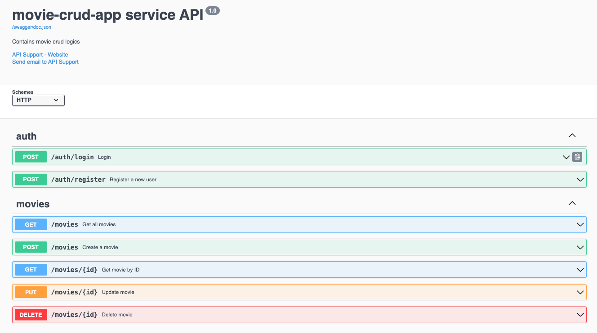

# 🎬 Movie CRUD App

A Go-based RESTful microservice for managing movies, featuring:

- JWT Authentication
- GORM with PostgreSQL
- Swagger Documentation (via Swag)
- Docker & Docker Compose support

---

## 📦 Getting Started

### 🐳 Run with Docker

```bash
make compose-up
```

This will spin up:

- The Go app on port `7900`
- PostgreSQL on port `5432`
- Run migrations automatically

---

## 🔐 Authentication

### ✅ Register

```bash
curl -X POST http://localhost:7900/auth/register \
  -H "Content-Type: application/json" \
  -d '{{
    "username": "admin",
    "email": "admin@example.com",
    "password": "123456"
  }}'
```

### 🔐 Login

```bash
curl -X POST http://localhost:7900/auth/login \
  -H "Content-Type: application/json" \
  -d '{{
    "email": "admin@example.com",
    "password": "123456"
  }}'
```

🔁 **Response:**

```json
{
  "status": "Success",
  "data": {
    "token": "<your-jwt-token>"
  }
}
```

---

## 🎬 Movie Endpoints

> All endpoints below require the JWT token in the header:

```bash
-H "Authorization: Bearer <your-jwt-token>"
```

### 🎥 Create a Movie

```bash
curl -X POST http://localhost:7900/movies \
  -H "Content-Type: application/json" \
  -H "Authorization: Bearer <your-jwt-token>" \
  -d '{{
    "title": "The Shawshank Redemption",
    "director": "Frank Darabont",
    "year": 1994,
    "plot": "Two imprisoned men bond over a number of years, finding solace and eventual redemption through acts of common decency.",
    "rating": 9.3
  }}'
```

### 📖 Get All Movies

```bash
curl -X GET http://localhost:7900/movies \
  -H "Authorization: Bearer <your-jwt-token>"
```

### 🔍 Get Movie by ID

```bash
curl -X GET http://localhost:7900/movies/1 \
  -H "Authorization: Bearer <your-jwt-token>"
```

### ✏️ Update Movie

```bash
curl -X PUT http://localhost:7900/movies/1 \
  -H "Content-Type: application/json" \
  -H "Authorization: Bearer <your-jwt-token>" \
  -d '{{
    "title": "Updated Title",
    "director": "Updated Director",
    "year": 2000
  }}'
```

### ❌ Delete Movie

```bash
curl -X DELETE http://localhost:7900/movies/1 \
  -H "Authorization: Bearer <your-jwt-token>"
```

---

## 🧪 Migrations

Run migrations using:

```bash
make migrate-up
```

Or rollback:

```bash
make migrate-down
```

---

## 📚 Swagger

Access interactive docs here:

👉 [http://localhost:7900/swagger/index.html](http://localhost:7900/swagger/index.html)

---

## 📅 Generated on

_2025-04-02 21:08:38_

Here’s what the Movie CRUD app looks like in action:


